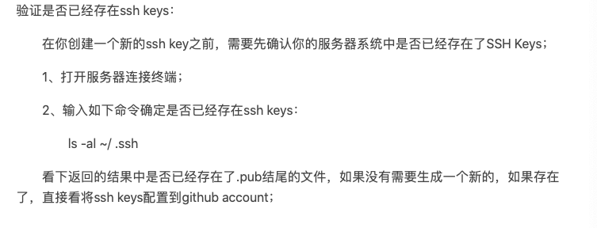

## Mac系统中，Https转换成Ssh连接github远程仓库

> 使用ssh连接远程仓库
>

### 需求背景

我在使用上传代码到github仓库上时，遇到了以下问题，无法上传代码到仓库里！

#### 问题 1

如何所示，本地仓库压缩代码完毕后，通过HTTP/2上传到远程仓库时，却意外挂断了！

#### 解决 1

如图所示，我没有使用第一中方式（担心引出其他项目问题），先是试用了更改http buffer，结果出现以下问题

#### 问题 2

如图所示，依旧无法访问远程仓库

### 吸取教训后，该用SSH

> 使用SSH协议，您可以连接和验证远程服务器和服务。 使用SSH密钥，您可以连接到GitHub，而无需在每次访问时提供您的用户名或密码。

### 实际操作

###### 步骤1:

验证自身电脑是否存在ssh keys！

###### 步骤2:

通过服务器终端命令行，找到.pub结尾的文件，打开文件，复制内容

1. 使用命令`ls -al ~/.ssh`找到.pub结尾的文件
2. 使用命令`open ~/.ssh`打开.pub结尾的文件位置
3. 使用命令`more id_rsa.pub`，展示文件，复制内容

###### 步骤3: 

将SSH Key内容添加到github上

###### 步骤4:

将本地仓库内容，上传到线上，测试成功！

 

### 参考链接

- [github配置 ssh(Mac)](https://blog.csdn.net/qq_34115898/article/details/90438106)
- [git 提交报错 error: RPC failed; curl 92 HTTP/2 ......](https://blog.csdn.net/wjk_along/article/details/104423443)
- [macbook怎么找到.ssh文件下id_rsa.pub](https://blog.csdn.net/qq_38658877/article/details/97612820)
- [mac系统 有什么软件 打开 .pub文件？](https://www.zhihu.com/question/26071345)
- [git remote添加其他SSH端口](https://blog.csdn.net/asdfgh0077/article/details/106924528)

